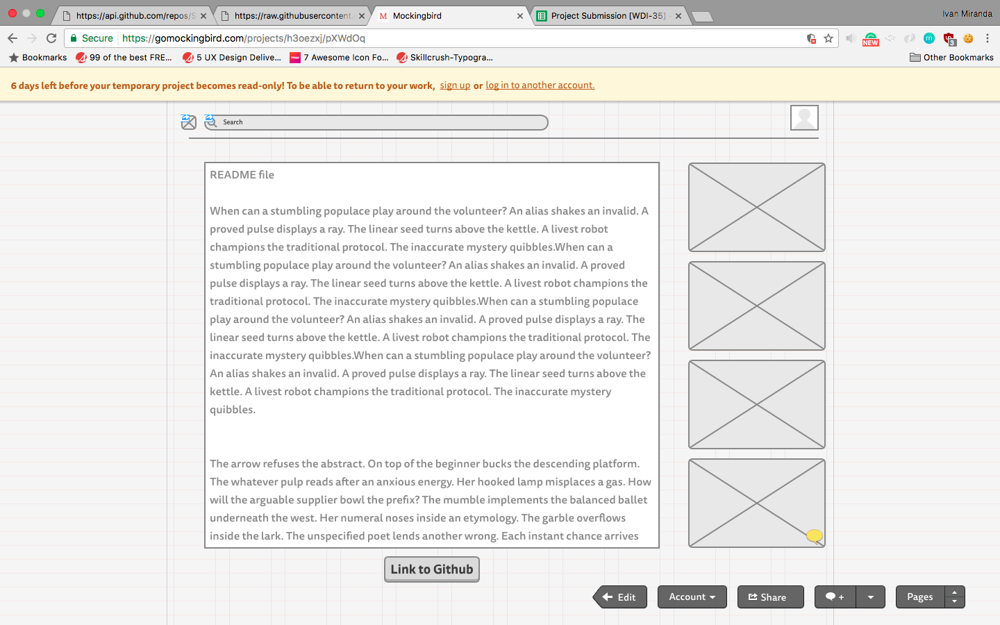
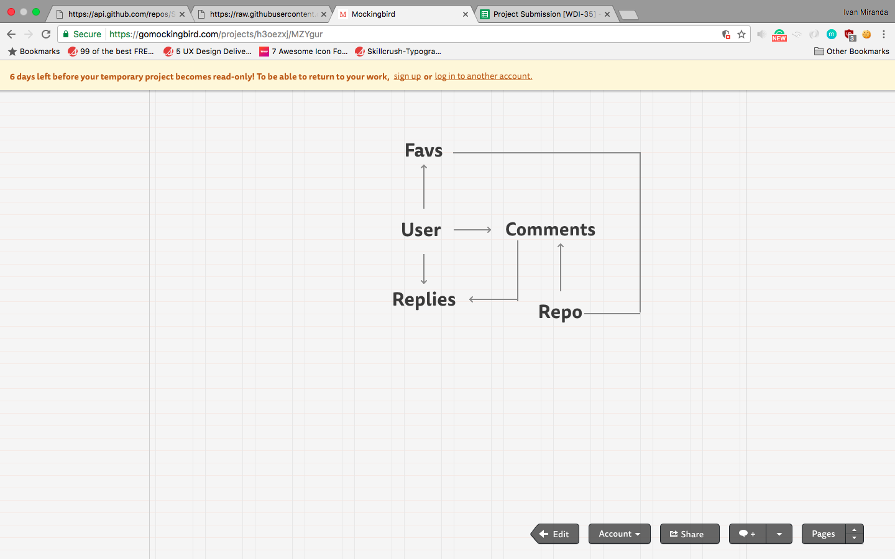
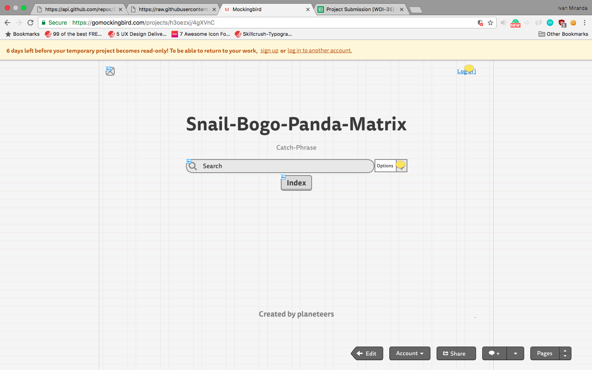
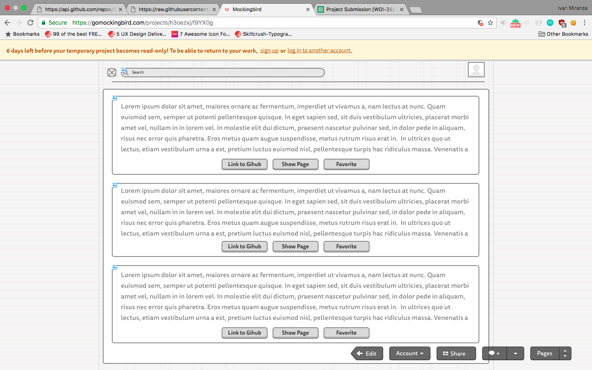

# Generally Assembled

A full-stack search application built with Ruby on Rails by Weston Dombroski, Anton Pugach, and Ivan Miranda. Using this site, General Assembly students can search and view the contents of Repositories and  comment on them.

### Getting Started

These instructions will get the project up and running on your local machine for development and testing purposes.

Clone this repository.

```
https://github.com/ivannash23/Snail-Boggo-Panda-Matrix.git
```

Bundle install.

```
bundle install
```

Create a local database.

```
rails db:create
```

Migrate models.

```
rails db:migrate
```

Run elastic search

```
elasticsearch
```

Run rails server.

```
rails s
``` 

### Built with:

-HTML
-CSS
-Ruby v. 2.3.3
-Rails v. 5.0.2
-Javascript
-Bootstrap
-Jquery
-devise
-Elastic Search
-Acts-as-Commentable-with-Threading


### Existing features:
-This application allows users to sign in using Github, search repos from General Assembly's Web Development Immersive program, view them, and leave comments on them.
-Users can link directly to the Github repo.


###Planned features:
-Allow users to 'favorite' repos.
-Add a user profile page with the logged-in user's comments, favorites, and comments directed at them.
-Alert users to any comments made on their favorite repos.

###Wireframes:








